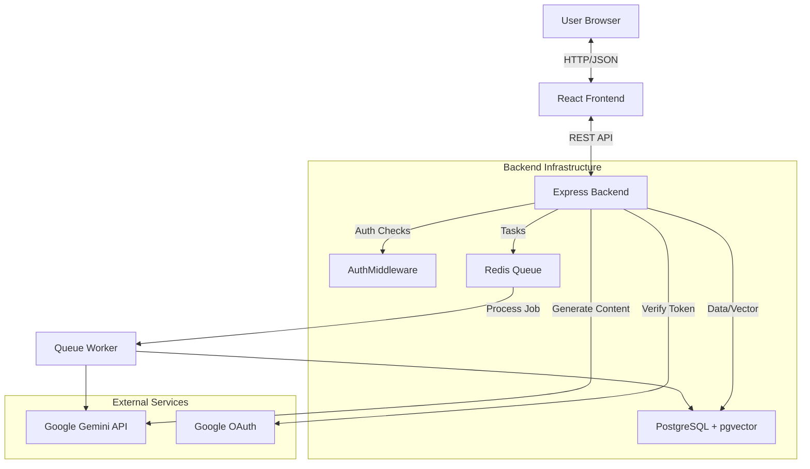

# 🧠 FlashMind AI - Project Architecture Map

This document outlines the structure, data flow, and connections within the FlashMind AI application.

## 📂 Directory Structure

```text
/
├── docker-compose.yml       # Sets up local PostgreSQL (DB) and Redis (Queue/Cache)
├── metadata.json            # Project metadata and permissions
├── frontend/                # React Application (The Client)
│   ├── index.html           # Entry point, Import Maps (CDN links)
│   ├── vite.config.ts       # Build config & Proxy setup (routes /api to backend)
│   ├── public/              # Static assets (Favicon, Avatars)
│   └── src/
│       ├── index.tsx        # React Mount point
│       ├── App.tsx          # Main Layout & Routing Logic
│       ├── api/
│       │   └── client.ts    # Fetch wrappers for Backend APIs
│       ├── components/      # UI Building Blocks
│       │   ├── AuthModal.tsx    # Login/Signup/Google Popup
│       │   ├── Flashcard.tsx    # 3D Flip Card Animation
│       │   ├── Header.tsx       # Nav, User Profile, Theme Toggle
│       │   ├── LoadingView.tsx  # Animated loading states
│       │   └── Quiz.tsx         # Interactive Quiz Component
│       ├── context/         # Global State Management
│       │   ├── AuthContext.tsx  # Stores User & Token
│       │   └── ThemeContext.tsx # Stores Light/Dark mode
│       ├── pages/           # Full Screen Views
│       │   ├── HomePage.tsx     # Landing page & History
│       │   └── StudySetPage.tsx # The generated content view
│       └── utils/
│           └── avatarUtils.ts   # Deterministic random avatar generator
│
└── backend/                 # Node/Express API (The Server)
    ├── .env                 # Secrets (API Keys, DB URL)
    ├── package.json         # Backend dependencies
    ├── migrations/          # SQL scripts to create DB tables
    └── src/
        ├── index.ts         # Server Entry, Rate Limits, Middleware
        ├── db/              # Database Connection (Postgres)
        ├── config/          # Prompts & Constants
        ├── middleware/      # Auth checks & Rate Limiters
        ├── routes/          # API Route Definitions (Auth)
        ├── services/        # Business Logic
        │   ├── ai.ts        # Gemini API interaction (Generation & Embedding)
        │   └── queue.ts     # BullMQ/Redis Job Queue
        └── repositories/    # Database Access Layer
            └── StudySetRepository.ts # SQL Queries (Insert, Select, Vector Search)
```

## 🏗 High-Level Architecture



## 🔄 Key Workflows

### 1. The Generation Flow (The Core Feature)
1.  **User** types a topic (e.g., "Photosynthesis") in `HomePage.tsx`.
2.  **Frontend** calls `api/client.ts` -> `POST /api/generate`.
3.  **Backend** (`index.ts`):
    *   Checks **Rate Limits** (Redis).
    *   Checks **Exact Cache** (Postgres): Has this specific string been asked?
    *   Checks **Semantic Cache** (Postgres + Gemini Embedding): Has something *similar* been asked?
4.  **Cache Miss**: Backend adds a job to the **Redis Queue** and returns a `jobId` immediately.
5.  **Frontend**: Starts polling `/api/jobs/:id`.
6.  **Worker** (`services/queue.ts`):
    *   Picks up the job.
    *   Calls **Gemini API** (`services/ai.ts`) with a strict JSON system prompt.
    *   Saves the result to **Postgres**.
7.  **Frontend**: Receives "Completed" status, gets the ID, and navigates to `StudySetPage.tsx`.

### 2. The Authentication Flow
1.  **User** clicks "Sign In" -> `AuthModal.tsx` opens.
2.  **User** enters Email/Pass OR clicks Google Login.
3.  **Backend** (`routes/auth.ts`):
    *   Verifies password (bcrypt) OR verifies Google Token.
    *   Issues a **JWT (JSON Web Token)**.
4.  **Frontend**: Saves JWT to `localStorage` and updates `AuthContext`.
5.  **Avatar**: `Header.tsx` uses the email to generate a consistent random animal avatar.

## 💾 Database Schema (PostgreSQL)

*   `users`: Stores credentials and names.
*   `study_sets`: Stores the main topic, summary, and the **Vector Embedding** (for AI search).
*   `flashcards`: Linked to study sets (Front/Back/Tags).
*   `quiz_questions`: Linked to study sets (Question/Choices/Answer).
*   `user_activity`: Many-to-Many link between Users and Study Sets (History).
